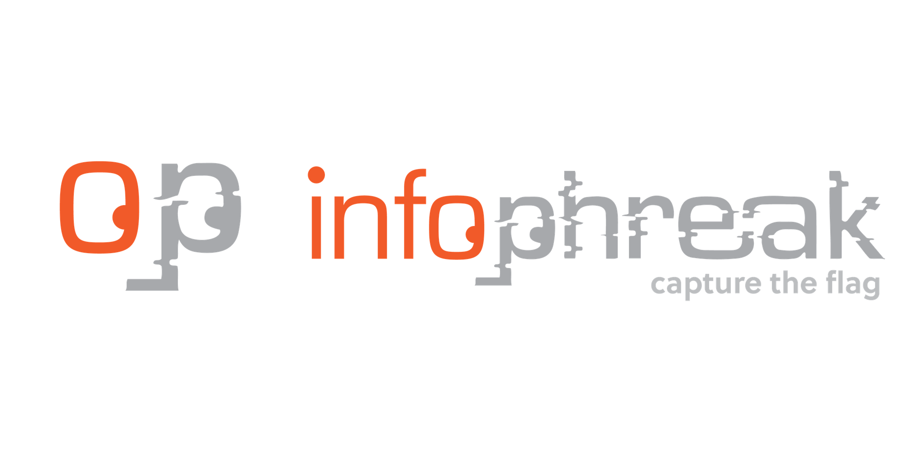

# Not This Again | Official Walkthrough

# Description

<aside>
💡 A mysterious file arrived at the Security Operations Center (SOC), baffling the team with its cryptic contents. Unable to decipher its meaning, they escalated it to the Malware Analysis Team, where I was tasked with unraveling its secrets.

🔒 Password: infected

</aside>

## Static Analysis

Firstly, I start off by tossing the executable into PE Studio to see what useful information I can obtain. A few things catch my eye

- The entropy being 7.6
- Section “MPRESS2” (A known packer used by malware authors)
- Strings: (The first few strings are Imports used by the program, I can use these as breakpoints during debugging of the executable)

| Location | Technique | Value |
| --- | --- | --- |
| section:.MPRESS2 | Access Token Manipulation (T1134) | OpenProcessToken |
| section:.MPRESS2 | - | PathCombine |
| section:.MPRESS2 | Execution through API (T1106) | ShellExecute |
| section:.MPRESS2 | - | GetModuleHandle |
| section:.MPRESS2 | - | GetProcAddress |
| section:.MPRESS2 | Obfuscated Files or Information (T1027) | CryptStringToBinary |
| section:.MPRESS2 | - | CRYPT32.dll |
| section:.MPRESS2 | - | KERNEL32.dll |
| section:.MPRESS2 | - | MessageBox |

Nothing else of interest was found in PE Studio, since the executable is packed I did not find anything of interest in the strings. 

---

## Dynamic Analysis

Remember the Imports found in the strings during Static Analysis? Well there are two strings in particular that caught my eye *”CryptStringToBinary”* this string tells me that there is some data either being encrypted or decrypted. And *”ShellExecute”* which indicates that there is a program being executed. Let’s head over to x64dbg (or any debugger of your choice) and see what’s going on under the hood.

Alright, first things first let’s set the breakpoint on those two imports, there will be two slight issue though, the first being that you will need to *“A”* to the end of the imports for example *“bp ShellExecuteA”. or “CryptStringToBinaryA”.* After setting a breakpoint on those imports, there is one last import that must be set otherwise the program with exit after being executed. *”IsDebuggerPresent”* This import is commonly used for anti-analysis and I tend to make it a habit of setting a breakpoint on this debugger before executing the program even if it doesn’t show up in imports or strings in PE Studio. Once we run the program and step over to the address where the pointer to *IsDebuggerPresent* is being called we can scroll down a bit to find the reset of the programs execution, including the string that is being decrypted by *CryptStringToBinaryA.*

Now that we have the encoded string, we need to decode it. Assuming it is Base64 is toss it into CyberChef too see what the output is. It appears Base64 was correct but it doesn’t look like this is the full encoded string. 

Despite this, I proceed with decoding the first 5 variables to see what the output gives me.

1. **Variable $a** (`aHR0cHM6Ly90Lmx5LzVuRC0t`):
    - Decoded string: `https://t.ly/5nD--`
2. **Variable $b** (No Base64 encoding, contains the system temp path):
    - System.IO.Path's `GetTempPath` function returns the path of the temporary folder on the system, like `C:\\Users\\[Username]\\AppData\\Local\\Temp\\`.
3. **Variable $c** (`Yi56aXA=`):
    - Decoded string: `b.zip`
4. **Variable $d** (`Y3Nyc3MuZXhl`):
    - Decoded string: `csrss.exe`
5. **Variable $e** (`QzpcV2luZG93cw==`):
    - Decoded string: `C:\\Windows`

With these variables decoded and broken down, we can infer that 

1. There will be a payload being downloaded from `hxxps://t[.]ly/5nD--`
2. The downloaded payload will be saved to the victims TEMP location.
3. The payload is most likely be saved as `b.zip` in some random folder existing (This is an assumption based on the portion where the $randomFolder variable is shown in the script) in the TEMP directory.
4. The script extracts the zip file and saves the `csrss.exe` to the `C:\\Windows` (This is an assumption).

Let’s go grab that payload and see what it’s doing!

---

## Analyzing the Payload

After downloading the payload from the `hxxps://t[.]ly/5nD--` URL, I do some static analysis (PE Studio) on it, to see what I can find. First thing I notice after downloading the script is that the zip is named “workdocs” which makes me assume that the script probably changes the name of the payload zip to `b.zip` before downloading. After extracting the zip we get the `csrss.exe` executable mentioned in the previous section. A few things I noticed about the file are:

- The large file size. (This large file size tells me that this program was probably compiled in a language such as Go, C# | .NET, or C++. Below is an explanation)

| File Size | 155585737 |
| --- | --- |

**C++**: C++ binaries can become large due to extensive use of template libraries (like the STL or Boost) or heavy inclusion of headers in different files. Compiling with optimizations like link-time optimization (LTO) may help reduce this somewhat.

**Go**: Go binaries tend to be statically linked, which means all required libraries are bundled within the executable. This approach increases portability but also increases binary sizes.

**C# (with .NET Core or .NET Framework)**: When targeting self-contained executables (which include the runtime with the application), the output sizes can become large due to the inclusion of the .NET runtime itself.

- The “version” tab (This program appears to masquerade as a legitimate Windows program. [What Is Client Server Runtime Process (csrss.exe), and Why Is It Running On My PC? (howtogeek.com)](https://www.howtogeek.com/321581/what-is-client-server-runtime-process-csrss.exe-and-why-is-it-running-on-my-pc/) )

| Property | Value |
| --- | --- |
| Footprint > sha256 | 8A7059C7464A78E79B34CBE0E77D6BE419E3AB886C5E2295FBFFC65549D543E7 |
| Location | .rsrc:0x0092CFD0 |
| Language | Neutral |
| Code-page | Unicode UTF-16, little endian |
| CompanyName | Microsoft Corporation |
| FileDescription | Client Server Runtime Process |
| FileVersion | 10.0.19041.3636 (WinBuild.160101.0800) |
| InternalName | CSRSS.Exe |
| LegalCopyright | © Microsoft Corporation. All rights reserved. |
| OriginalFilename | CSRSS.Exe |
| ProductName | Microsoft® Windows® Operating System |
| ProductVersion | 10.0.19041.3636 |
- When pulling strings I did a search for “go.” and didn’t find any indicators that this was a Go executable. Although when I searched for “dotnet” and “.NET”, I came across a few hits.

Assuming that this executable was written in .NET, I open up ILSpy which is a tool used to analyze .NET executables. Once you drop csrss.exe into ILSpy, scroll all the way down until you see *“YouAreAnIdiot (1.0.0.0, .NETCoreApp, v8.0)”* and navigate to *“Form1”.* This is where all the magic happens!

Scrolling down a few lines, you will see the functions *“Button_Click”* and *“DecryptFlag”.*  In the button click function we can see a reference to DecryptFlag and a Base64 string. In the DecryptFlag function we can get an understanding of what’s happening, here’s the breakdown:

1. **Input Parameter**:
    - The function receives a string parameter **`encryptedFlag`**.
2. **Base64 Decoding**:
    - The first operation uses **`Convert.FromBase64String`** to decode the Base64-encoded **`encryptedFlag`** into a byte array **`bytes`**.
3. **UTF-8 Decoding**:
    - The byte array **`bytes`** is then converted into a string using UTF-8 encoding: **`Encoding.UTF8.GetString(bytes)`**.
    - The resulting string is stored in the variable **`@string`**.
4. **Stack Initialization**:
    - A stack of characters is initialized: **`Stack<char> stack = new Stack<char>();`**.
5. **XOR Decryption**:
    - The decrypted text starts with the string **`@string`**.
    - The **`foreach`** loop iterates over each character **`c`** in **`text`**.
    - For each character **`c`**, the loop applies an XOR operation with **`0x49`** (an unsigned hexadecimal constant).
    - The resulting decrypted character is cast back to **`char`** and pushed onto the **`stack`**.
6. **Reversing the Stack**:
    - A new **`StringBuilder`** is initialized: **`StringBuilder stringBuilder = new StringBuilder();`**.
    - While the stack isn't empty, the characters are popped out of the stack in reverse order and appended to the **`StringBuilder`**.
7. **Returning the Decrypted Flag**:
    - Finally, the constructed string is returned by calling **`stringBuilder.ToString()`**.

### **Summary**

This function decrypts the Base64-encoded input string by:

1. Decoding the input using Base64.
2. Performing a simple XOR operation with a constant (**`0x49`**) to decrypt each character.
3. Reversing the decrypted characters to reveal the original text.
    
    
    

## Get the Flag

Now that we have an understanding of what’s going on in the DecryptFlag function, we can grab that Base64 string and head on over to CyberChef to cook up a recipe to obtain the flag!

# Connect With Me!

[https://img.shields.io/website?label=IAANSECURITY&style=for-the-badge&url=https%3A%2F%2Fiaansecurity.com&color=green](https://img.shields.io/website?label=IAANSECURITY&style=for-the-badge&url=https%3A%2F%2Fiaansecurity.com&color=green)

[https://img.shields.io/website?label=dev.to&style=for-the-badge&url=https%3A%2F%2Fdev.to/l0wk3y&color=orange](https://img.shields.io/website?label=dev.to&style=for-the-badge&url=https%3A%2F%2Fdev.to/l0wk3y&color=orange)

[https://img.shields.io/website?label=GitHub&style=for-the-badge&url=https%3A%2F%2Fgithub.com/l0wk3y&color=yellow](https://img.shields.io/website?label=GitHub&style=for-the-badge&url=https%3A%2F%2Fgithub.com/l0wk3y&color=yellow)